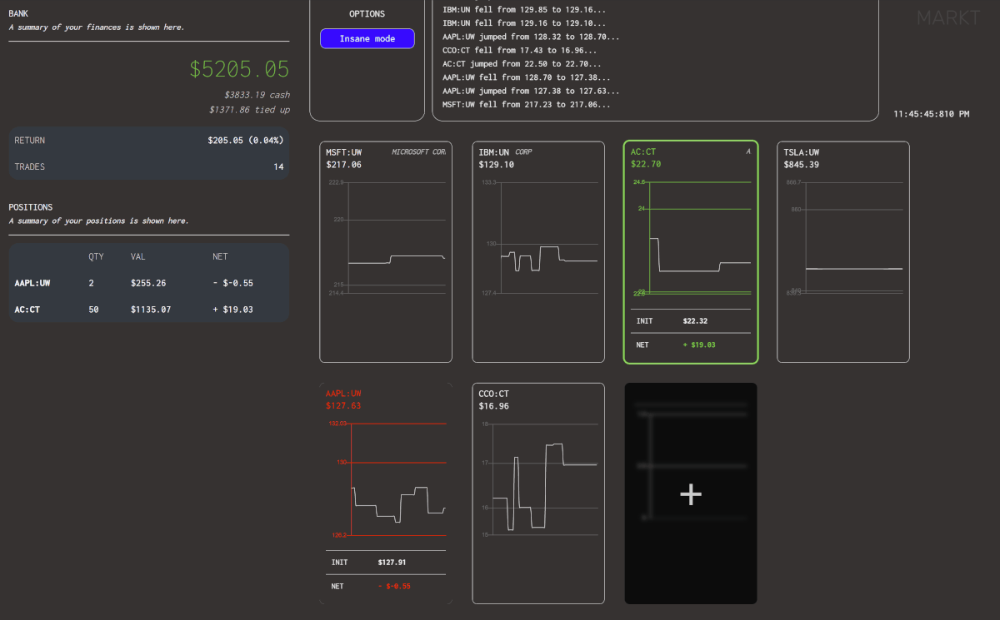

# markt-web
A stock market simulator built with Vue.js and Bootstrap. Please visit https://markt.kylegrimsrudma.nz to try it out. 

Market data is retrieved using [bnnbloomberg-markets-api](https://github.com/vxsl/bnnbloomberg-markets-api), my unofficial Javascript wrapper for BNN Bloomberg's market data API.
